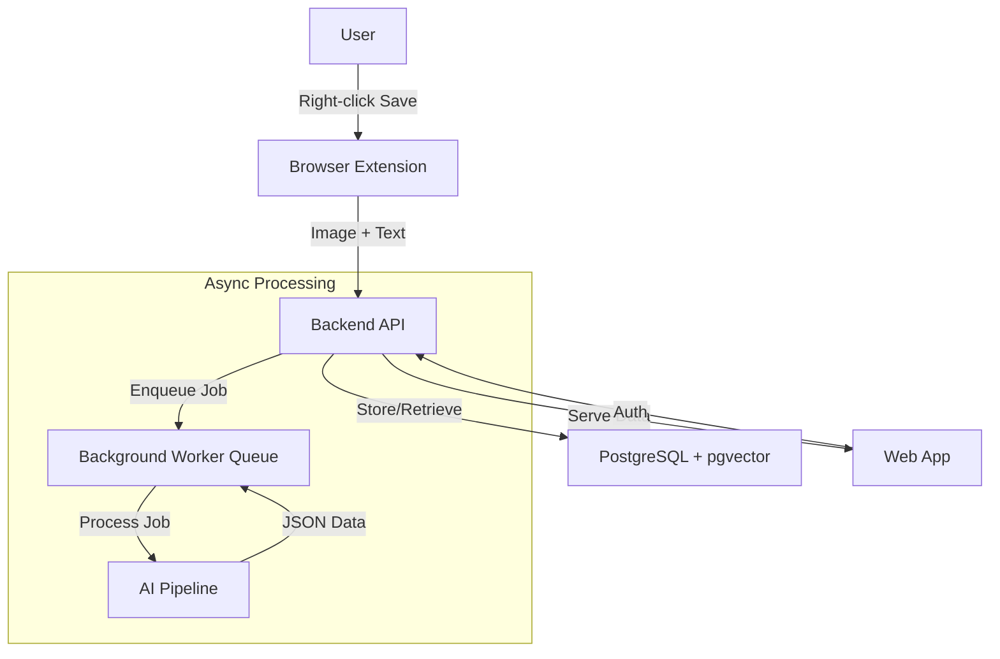

# System Architecture – Rolodex

## 1. Overview
Rolodex is composed of a browser extension, backend API, AI pipeline, and a web app. The system is designed for modularity, scalability, and best-in-class UX.

## 2. High-Level Diagram


## 3. Data Flow
1. User right-clicks image, triggers extension.
2. Extension grabs image + context, sends to backend.
3. Backend calls AI pipeline for extraction.
4. AI returns structured JSON (title, vendor, etc.).
5. Backend stores item in DB (with vector embedding).
6. Web app fetches, searches, and organizes items.
7. Moodboard export triggers outpainting/generation.

## 4. API Contract

### Endpoints
| Method | Path                                 | Description                                 |
|--------|--------------------------------------|---------------------------------------------|
| POST   | /api/extract                         | Extract product data from image/text        |
| POST   | /api/items                           | Create new item                             |
| GET    | /api/items?query=...                 | Search/filter items                         |
| POST   | /api/projects                        | Create new project                          |
| POST   | /api/projects/:id/add_item           | Add item to project                         |
| GET    | /api/projects/:id                    | Get project details                         |
| GET    | /api/projects/:id/moodboard          | Generate/export moodboard                   |
| POST   | /api/projects/:id/scheme_suggestion  | Suggest items for a brief                   |

### Example Request/Response
#### POST /api/extract
Request:
```json
{
  "image_url": "https://...",
  "raw_text": "Sofa, velvet, $1200, green, West Elm"
}
```
Response:
```json
{
  "title": "Green Velvet Sofa",
  "vendor": "West Elm",
  "price": 1200,
  "currency": "USD",
  "description": "A plush green velvet sofa...",
  "colour_hex": "#4A6B3C",
  "category": "Sofa",
  "material": "Velvet"
}
```

#### GET /api/items?query=sofa&hex=4A6B3C&price_max=2000
Response:
```json
[
  {
    "id": "uuid",
    "img_url": "https://...",
    "title": "Green Velvet Sofa",
    "vendor": "West Elm",
    "price": 1200,
    "currency": "USD",
    "description": "A plush green velvet sofa...",
    "colour_hex": "#4A6B3C",
    "category": "Sofa",
    "material": "Velvet",
    "src_url": "https://...",
    "created_at": "2024-06-07T12:00:00Z"
  }
]
```

## 5. Database Schema
```sql
CREATE TABLE items (
  id UUID PRIMARY KEY,
  owner_id UUID REFERENCES users(id),
  img_url TEXT,
  title TEXT,
  vendor TEXT,
  price NUMERIC,
  currency TEXT,
  description TEXT,
  colour_hex CHAR(7),
  category TEXT,
  material TEXT,
  src_url TEXT,
  embedding vector(512),
  created_at TIMESTAMPTZ DEFAULT now()
);

CREATE TABLE projects (
  id UUID PRIMARY KEY,
  owner_id UUID REFERENCES users(id),
  name TEXT,
  created_at TIMESTAMPTZ DEFAULT now()
);

CREATE TABLE project_items (
  project_id UUID REFERENCES projects(id) ON DELETE CASCADE,
  item_id UUID REFERENCES items(id) ON DELETE CASCADE,
  PRIMARY KEY (project_id, item_id)
);

CREATE TABLE users (
  id UUID PRIMARY KEY,
  email TEXT UNIQUE NOT NULL,
  password_hash TEXT,
  created_at TIMESTAMPTZ DEFAULT now()
);
```

## 6. Infra/Deployment Diagram
```mermaid
graph TD
  subgraph Cloud
    A[Chrome Extension]
    B[Web App (Vercel/Netlify)]
    C[FastAPI Backend (Fly.io)]
    D[PostgreSQL + pgvector (Supabase)]
    E[Object Storage (Supabase S3/AWS S3)]
    F[OpenAI/CLIP API]
  end
  A -- API --> C
  B -- API --> C
  C -- DB --> D
  C -- Storage --> E
  C -- AI Calls --> F
```

## 7. Secrets & Env
- See [.env.example](./.env.example) for required environment variables. 